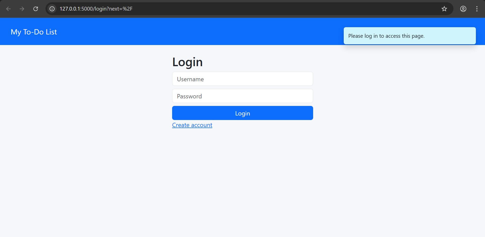
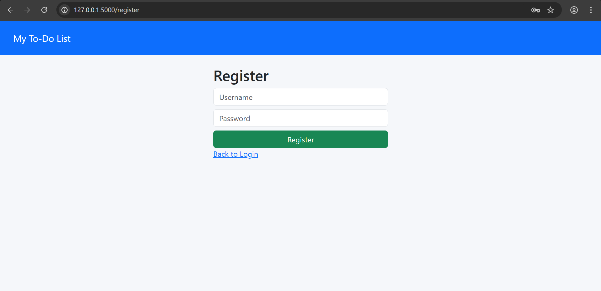
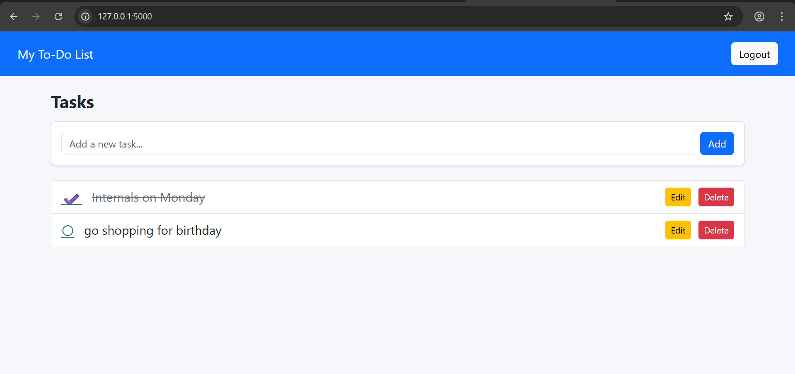
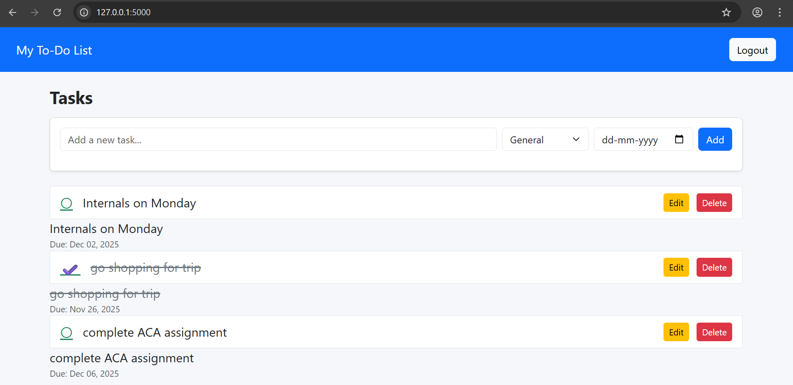

Flask To-Do App

A simple, secure, and responsive To-Do web application built with Flask, SQLite, and Bootstrap.
Features include user registration/login, task creation/editing/deletion, categories, due dates, and drag-and-drop reordering.

Features:-

 User authentication (register, login, logout) using `Flask-Login`
 Password hashing with `Flask-Bcrypt`
 Persisted tasks via `SQLite` + `Flask-SQLAlchemy`
 Task fields: text, completed status, category, due date
 
Prerequisites:-

- Python 3.8+  
- Git (for version control)

Project Structure:-

flask_todo_app/  
├─ app.py   
├─ database.db           
├─ requirements.txt   
├─ templates/   
  ├─ layout.html   
  ├─ index.html    
  ├─ login.html   
  └─ register.html   

 Screenshots

Login Page

Register Page

Task Page (View 1)

Task Page (View 2)

